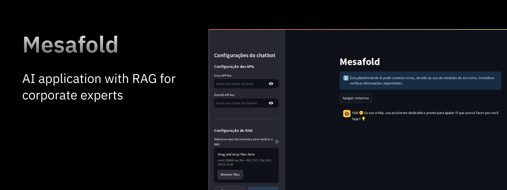

# Mesafold AI Application



O Mesafold é apenas um projeto demonstrativo de um aplicativo de IA generativa com o objetivo de reunir os melhores modelos de IA do mercado e centraliza-los em uma aplicação única e capaz de usufruir do poder das IAs generativas dentro do ambiente corporativo para auxiliar especialistas nas tomadas de decisões e linhas de pensamento baseadas em fatos, documentos e outros dados.

# Objetivo

O projeto é uma aplicação útil para especialistas que desejam ter assistentes poderosos que auxiliem nas tomadas de decisões e linhas de pensamento, dividindo a carga de trabalho e energia de tarefas muitas das vezes desgastantes, podendo poupar energia mental para outras atividades, assim delegando tarefas repetitivas.

# RAG Engine

A aplicação possui um motor de RAG (Retrieval Augmented Generation) para consumir dados externos, sendo documentos de diversos formatos e armazenar estas informações em um banco de dados de conhecimento, onde por sua vez, um mecanismo de busca semântica realiza a busca e acrescenta as informações com o prompt ao modelo de LLM disponivel dentro da aplicação.

Com este recurso, os modelos de LLM podêm construir respostas precisas e confiavéis, baseadas em fatos, documentos e outros dados.

## Instalação

Siga as instruções abaixo para instalar e configurar o projeto em sua máquina local:

### Pré-requisitos

Certifique-se de que os seguintes softwares estão instalados no seu sistema:

- **Git**: Para clonar o repositório. [Instruções de instalação do Git](https://git-scm.com/book/en/v2/Getting-Started-Installing-Git)
- **Python 3.10 ou superior**: Para executar o projeto. [Instruções de instalação do Python](https://www.python.org/downloads/)

### Passos para instalação

1. **Clone o repositório do GitHub**:
   Abra um terminal e execute o comando abaixo para clonar o repositório para o seu diretório local:

   ```bash
   git clone https://github.com/Gabrieln18/mesafold_ai.git
   ```

   2. Acesse o diretório do projeto: Navegue até a pasta do projeto recém-clonado:

   ```
   cd nome-do-projeto
   ```

   Crie um ambiente virtual (opcional, mas recomendado):

   ```
   python -m venv venv
   source venv/bin/activate      # No Linux/Mac
   venv\Scripts\activate         # No Windows
   ```

   Instale as dependências do `requirements.txt`:

   ```
   pip install -r requirements.txt
   ```

## Como usar

Para executar o projeto, siga os passos abaixo:

1. **Abra o terminal**:
   Certifique-se de que o terminal da sua máquina está aberto.

2. **Navegue até o diretório do projeto**:
   Use o comando `cd` para acessar a pasta onde o projeto foi clonado. Por exemplo:

   ```bash
   cd caminho/para/o/diretorio-do-projeto
   ```

   Execute o projeto com o Streamlit: Utilize o comando abaixo para iniciar o projeto:

   ```bash
   streamlit run app.py
   ```

   Acesse a aplicação: Após executar o comando, o Streamlit abrirá automaticamente o navegador com o endereço da aplicação. Caso não abra, copie o link exibido no terminal (geralmente http://localhost:8501) e cole no navegador.

# Requisitos

- Python 3.10+

# Nota

Este projeto é apenas uma demonstração básica e poderosa de como a tecnologia de IA ou LLMs pode ser implementada com eficiência em um ambiente corporativo para auxiliar colaborades com tomada de decisões baseadas em fatos, documentos e outros dados.
